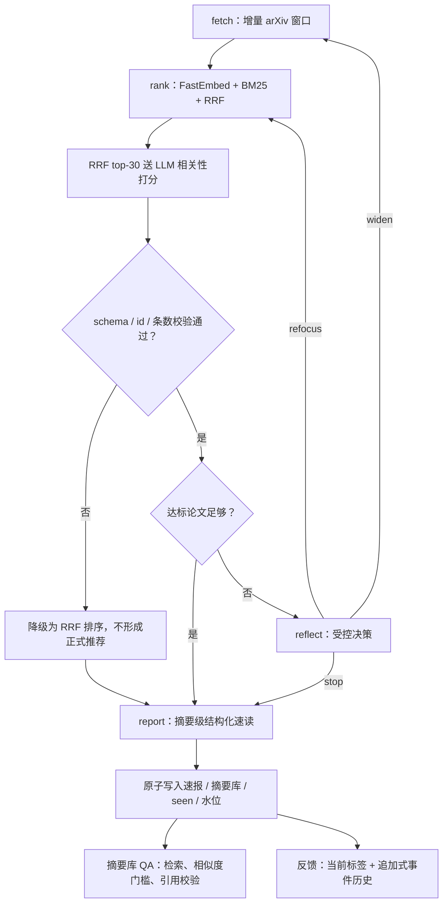

# arXiv 论文追踪 Agent

一个面向 LLM Agent / RAG 研究方向的摘要级论文筛选工作流：增量抓取 arXiv 新论文，用混合检索和 LLM 精排生成中文速报，并在相关结果不足时由 LangGraph 节点在受控动作空间内反思与路由。

> 能力边界：项目只使用 arXiv 标题和摘要，没有读取 PDF 全文；`graph.py` 是单次运行入口，不自带定时调度器。偏好反馈会被记录，但当前仅有 3 个 anchor，生产偏好权重保守设为 `0.0`，不宣称系统已经“越用越准”。

## 30 秒查看项目

安装依赖后，以下四条命令分别展示输出语义、工程测试、公开证据完整性和 Agent 路由契约：

```bash
python graph.py --demo
DEEPSEEK_API_KEY= python -m pytest -q
python scripts/export_eval_snapshot.py --verify-only
DEEPSEEK_API_KEY= python agent_eval.py
```

- `--demo` 使用固定 fixture，不需 API key、不联网、不写入本地运行数据。
- 单元测试覆盖混合检索、LLM 返回校验与降级、Agent 路由、抓取水位、反馈反转、QA 引用检查和评测口径；CI 也在无 key 环境运行全量 `pytest`。
- 冻结证据包可在没有个人 profile 和运行态 JSON 的公开仓库中独立校验。
- Agent 情景评测默认注入冻结决策，不调用模型；故障样本会实际经过生产 parser、validator 和 route。

一份不声称读过全文的速报展示见 [examples/report_sample.md](examples/report_sample.md)。

## 工作流



`reflect` 不是无约束的“自主 Agent”。它只能选择 `widen` / `refocus` / `stop`，新 arXiv 分类必须命中显式白名单，新 query 需通过语言、长度和变化检查，同时受抓取轮数和反思次数限制。这里展示的是“LLM 决策 + 确定性约束 + 失败降级”的 Agent 工程思路。

## 工程要点

| 问题 | 实现 |
|---|---|
| 新论文会被 top-N 抓取永久漏掉 | 按 UTC 提交时间窗口分页抓取；首次回看 7 天，之后从成功水位回退 15 分钟，用规范化 arXiv ID 去重 |
| 语义检索和字面匹配各有盲区 | 多语种 FastEmbed 向量召回 + BM25 关键词召回，通过 RRF 融合 |
| 抓取量增大时 LLM 费用线性增长 | 先召回，只对 RRF top-30 做 DeepSeek 打分；合法结果用版本化内容指纹缓存 |
| LLM 漏条、错位或返回脏数据 | 要求回填 `id`，严格检查 JSONL 字段集、类型、0–10 整数范围、唯一 ID 和完整条数；整批重打后仍异常则回退 RRF，异常占位不入缓存 |
| arXiv 文本包含 Prompt Injection | 标题/摘要用 JSON 数据边界封装，打分、摘要速读和反思均有 system 约束；动作和分类再做程序白名单验证 |
| 中途崩溃损坏 JSON 或跳过抓取窗口 | 文本/JSON 通过同目录临时文件 + `fsync` + `os.replace` 原子替换；关键 read-modify-write 还使用文件锁；只在报告和状态完整落盘后推进抓取水位 |
| Agent 动作难解释、难与固定策略比较 | 速报保留 action / source / reason 决策轨迹；12 个合成场景直接复用生产反思节点，并报告 always-widen / always-stop 基线 |
| 反馈标签反转后同时出现在 liked/disliked | 同一论文只保留一个当前状态，同时在 `feedback_events` 保留追加式审计历史 |
| 摘要库 QA 强行作答 | 对每个候选单独过相似度门槛；没有证据则拒答，生成后再检查引用编号是否存在且越界 |

## 安装

推荐 Python 3.13（CI 使用该版本）：

```bash
python3 -m venv .venv
source .venv/bin/activate                 # Windows: .venv\Scripts\activate
python -m pip install -r requirements.txt
```

FastEmbed 模型 `paraphrase-multilingual-MiniLM-L12-v2` 不包含在仓库中。第一次真正运行向量检索时会联网下载约 **0.22–0.24 GB** 到本机缓存；之后可复用。`graph.py --demo` 不会触发该下载。

## 运行方式

### 1. 纯离线 demo

```bash
python graph.py --demo
```

它只展示“达标推荐 / 探索候选 / 摘要级结构化输出”的格式和语义，不能代表真实检索质量。

### 2. 在线生成一期速报

复制配置并填入 DeepSeek API key：

```bash
cp .env.example .env
# 编辑 .env：DEEPSEEK_API_KEY=...
python graph.py
```

此命令会访问 arXiv 和 DeepSeek，也可能触发首次 FastEmbed 模型下载。它会在项目目录产生 `速报_YYYY-MM-DD.md`，并更新本地摘要库、去重集和成功水位。这是“运行一次”而非“每天自动运行”；如需周期执行，可由 cron / 任务调度平台外部触发。

默认兴趣画像定义在 `retrieval.py` 的 `INTEREST`。首次运行后会成为本地 `profile.json` 的种子；已有 profile 时，应修改其 `interest` 字段而不是只改默认常量。

### 3. 记录反馈

```bash
python feedback.py 1 up
python feedback.py 2 down
```

序号只对应最近速报中达到 `7/10` 阈值的正式推荐。反馈会更新 liked/disliked 向量 anchor、当前标签和事件历史。

当前 `PREF_WEIGHT = 0.0`：记录链路和重排实现已存在，但 3 个 anchor 不足以证明正权重能泛化，所以反馈暂不改变在线排序。积累更多可追溯标注后，应只在 dev 集选权重，再在 held-out test 评估一次：

```bash
python tune.py --seed 20260717 --weights 0,1,2,3,5,8
```

### 4. 摘要库问答

```bash
python qa.py "论文库里有哪些关于 Agent 记忆和混合检索的工作？"
python qa.py "某个具体问题" --top-n 6
```

QA 会调用 DeepSeek 将问题补成英文检索 query，再复用 BM25 + 向量 + RRF 召回。模型最终只看通过相似度门槛的标题和摘要，回答必须引用有效编号；否则返回拒答信息。这是摘要库 RAG，不是 PDF 分块、全文索引或严格事实核查系统。

## 评测与证据

### 公开冻结快照

[`eval_data/eval_v1.json`](eval_data/eval_v1.json) 冻结了评测输入、历史分数/理由和确定性 split；详细来源、schema 和限制见 [`eval_data/DATACARD.md`](eval_data/DATACARD.md)。

| 字段 | 数量 / 语义 |
|---|---|
| 论文记录 | 210（标题 + arXiv 摘要） |
| judged | 104：`rel=25`，`irrel=79` |
| 未标注 | 106，不能默认当作负例 |
| anchor | 3；优先隔离，避免偏好泄漏到调参/测试 |
| split | `anchor=3`，`dev=72`，`test=30`，`unjudged=105` |
| records SHA-256 | `9adc55b6d6ec5fec16a7947c2d90925a9bb8cffc54364e68234147406a0cf60a` |

其中一条 anchor 没有历史标签，所以全局未标注数是 106，而 `unjudged` split 是 105。

无 key、无私有源文件校验快照：

```bash
python scripts/export_eval_snapshot.py --verify-only
```

若本地保留导出时的 `papers_store.json` / `labels.json` / `profile.json` / legacy `scores_cache.json`，可检查它们能否精确重建已提交快照，不写文件：

```bash
python scripts/export_eval_snapshot.py --check
```

### 离线快照评测与当前在线评测

```bash
# 使用冻结 records / labels / splits / legacy score；不调 DeepSeek，默认 split=test
python eval.py --snapshot eval_data/eval_v1.json

# 需要时也可显式选择 test / dev / all
python eval.py --snapshot eval_data/eval_v1.json --split test

# 使用本地运行态、当前 Prompt/缓存，可能调 DeepSeek
python eval.py
```

两者不可混为同一个结果：

- 快照中的 `label` 是历史 **LLM-as-a-judge 银标签**，项目没有保存每条标签的人工复核人、时间和规则，因此不是人工金标。
- 冻结 `score/reason` 是 legacy LLM 历史输出；旧缓存没有保留完整的模型、Prompt 和解析 schema 元数据，它不是当前打分 Prompt 的重放，也不调用 DeepSeek。
- 默认 `test` 评测会从候选池移除 anchor 和 dev 记录，但保留 unjudged 论文作为真实检索干扰项；只用 test 标签计算指标。
- 离线快照评测仍会运行 BM25 / FastEmbed / RRF，因此第一次可能下载 0.22–0.24 GB 向量模型。
- 本地在线评测走与生产相同的 `RRF -> top-30 -> LLM` 漏斗，且当前缓存绑定模型、Prompt/schema 指纹、兴趣画像和论文内容；输入变化会安全失效并产生新的 API 调用。

2026-07-17 的一次 `test` 参考运行见
[`eval_data/eval_v1_reference.md`](eval_data/eval_v1_reference.md)。其中混合 RRF 的
judged P@10 / R@10 / Coverage 为 `0.833 / 0.714 / 0.600`；加入冻结 legacy LLM
分数后为 `1.000 / 0.571 / 0.400`。这说明 LLM 提高了低覆盖 top-10 的已判定纯度，
但没有提高 judged Recall；因此项目不把单个 `1.000` 当作总体质量结论。

两个评测入口均应报告：

- `P@K (judged)`：top-K 中相关 judged 数 / top-K 中 judged 数；
- `R@K (judged)`：top-K 中相关 judged 数 / 评测池中全部相关 judged 数；
- `Coverage`：top-K 中 judged 占比；
- 1000 次随机基线的均值/标准差，以及 LLM 阈值在已判定候选上的混淆矩阵、Balanced Accuracy 和 Cohen's kappa。

未标注项不视为 `irrel`；任何高 Precision 都必须与 Coverage 一起解读。当前仓库只冻结输入、split 和 legacy 输出，**不将某次新模型指标宣称为已冻结结论**。

如需增加人工标注，可先生成不展示模型分数/理由的随机盲核清单，再按序号写入标签：

```bash
python random_check.py 18 --seed 2026
python label.py
python label.py rel 1 5 8
python label.py irrel 2 3 4
```

### Agent 决策专项评测

排序评测只能证明检索/精排，不能证明 `reflect` 决策。项目另提供 12 个脱敏合成场景，
覆盖分类过窄、兴趣过宽、已有近匹配、空候选、恶意标题、非法 action/category 和
refocus query 校验：

```bash
# 默认读取人工编写的冻结 raw output：无 key、无网络、0 次模型调用
DEEPSEEK_API_KEY= python agent_eval.py

# 用当前 DeepSeek 替换冻结输出；每个场景进入一次 reflect policy
python agent_eval.py --live
```

默认离线结果 action/constraint `12/12`、故障样本 fail-closed `4/4`，证明的是生产
parser/validator/router 对固定 fixture 的契约，不是模型准确率。2026-07-17 的一次性
DeepSeek A/B 最终在 8 个 policy 场景上得到：

| 指标 | 最终在线结果 | 固定动作基线 |
|---|---:|---:|
| Action accuracy | 8/8 (100%) | always-widen 3/8；always-stop 3/8 |
| Schema valid | 8/8 (100%) | — |
| Constraint pass | 7/8 (87.5%) | — |

唯一 constraint failure 来自一个本身有标签张力的 broad-query 场景，项目没有在看到输出后
改标签凑满分。完整四轮 `4/8 -> 4/8 -> 7/8 -> 8/8` A/B、恶意标题修复过程、浮动模型
版本和限制见
[`agent_eval_data/live_reference_2026-07-17.md`](agent_eval_data/live_reference_2026-07-17.md)；
数据卡见 [`agent_eval_data/DATACARD.md`](agent_eval_data/DATACARD.md)。这是 synthetic
contract benchmark，不代表最终推荐收益、真实流量质量或统计显著性。

## 目录结构

| 路径 | 职责 |
|---|---|
| `graph.py` | LangGraph 节点、条件边、受控反思路由、速报组装与 demo |
| `daily.py` | arXiv 时间窗口/分页抓取、水位与 DeepSeek 共享客户端 |
| `retrieval.py` | FastEmbed / BM25 / RRF、top-30 漏斗、严格打分校验、缓存、偏好重排、摘要级速读 |
| `memory.py` / `feedback.py` | 当前偏好、追加式事件、反馈 CLI 与评测 anchor |
| `qa.py` | 本地摘要库、混合检索问答、相似度门槛与引用检查 |
| `storage.py` | JSON/文本的原子替换与带文件锁更新 |
| `eval.py` / `tune.py` | judged metrics、coverage、生产漏斗消融、确定性 dev/test 调参 |
| `agent_eval.py` / `agent_eval_data/` | 反思动作合成情景、静态策略基线、fail-closed 契约与一次性在线 A/B |
| `scripts/export_eval_snapshot.py` | 脱敏导出和校验冻结评测证据 |
| `eval_data/` / `examples/` | 数据卡、冻结快照和摘要级速报样例 |
| `test_*.py` / `.github/workflows/tests.yml` | 无 key 单元测试与 GitHub Actions CI |

个人运行态（`.env`、profile、反馈、缓存、摘要库、seen/水位、速报）均由 `.gitignore` 排除，公开证据包不包含 API key 或个人兴趣文本。

## 已知限制与后续工作

- 只有标题和摘要，无法验证全文中的实验设置、数据集、数值结果或证明细节。
- 104 条 judged 为银标签，且仅覆盖 210 条快照的一部分；需按预注册标注准则做双人独立复核，才能建立更可信的金标测试集。
- 当前默认兴趣为代码/profile 配置，还没有多用户画像、Web 界面或鉴权。
- 偏好重排的正权重尚未被 held-out 证据支持，因此默认关闭对排序的影响；这是有意的保守失败策略。
- 在线运行依赖 arXiv、DeepSeek 和首次模型下载；当前没有服务化部署、指标监控或端到端调度。
- Prompt 边界、schema 检查和白名单能降低风险，但不等于对 Prompt Injection 的形式化安全保证。
- Agent 路由评测是 12 个开发者标注的 synthetic 场景；仍需真实运行日志、用户效用和成本/时延指标验证外部有效性。

这个项目的重点不是把一次 LLM 调用包成“Agent”，而是把召回、决策、校验、降级、状态与评测口径放在同一个可测试工作流中。
